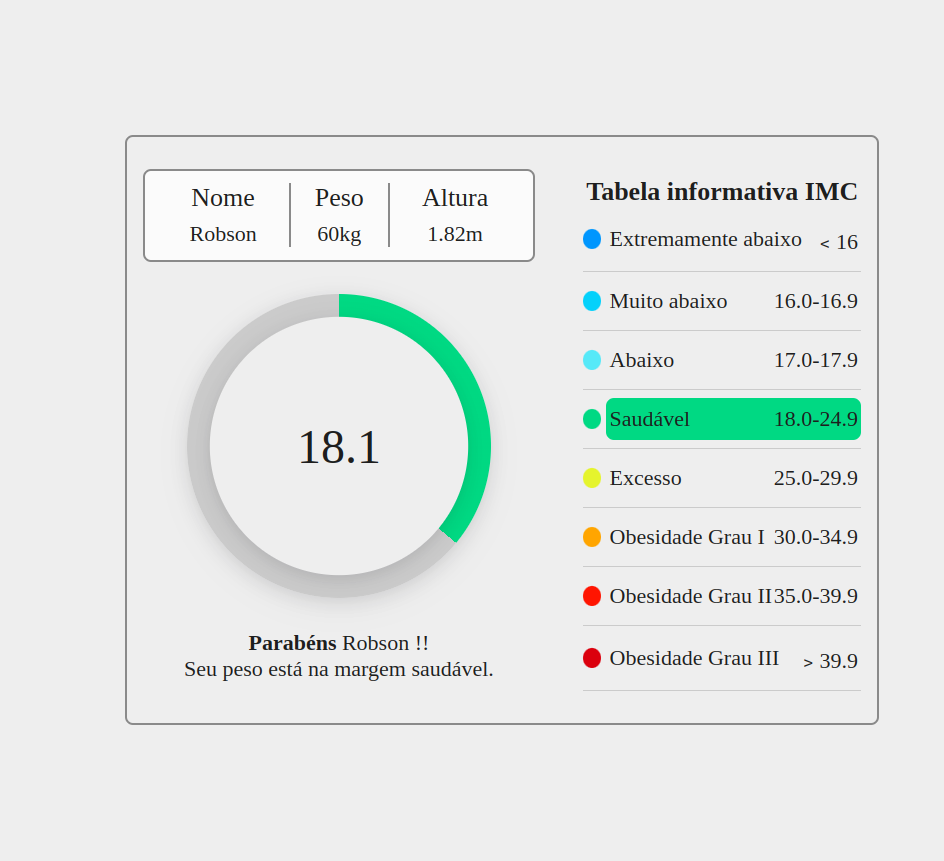

# Calculadara IMC interativa
Neste projeto, o usuário responde a algumas perguntas simples para gerar um gráfico informativo sobre seu IMC (Índice de Massa Corporal). A aplicação foi desenvolvida com React e TypeScript, enquanto os estilos foram implementados com SASS. Animações interativas foram adicionadas com Lottie React, trazendo dinamismo à interface. Para otimizar a performance, utilizei o Vite como bundler, garantindo carregamentos mais rápidos.
 
 

## Tecnologias Utilizadas

&nbsp;
&nbsp;
&nbsp;
&nbsp;
&nbsp;
 
 

## Link Demo: [Calculadora IMC](https://calculadora-imc-three-gold.vercel.app/)

  

